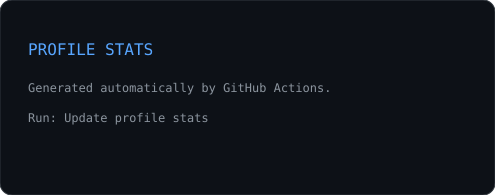
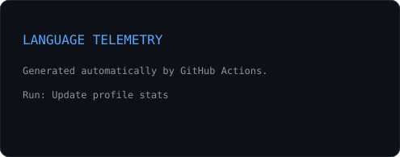

<div align="center">

<picture>
  <source media="(prefers-color-scheme: dark)" srcset="./assets/hero-dark.svg">
  <source media="(prefers-color-scheme: light)" srcset="./assets/hero-light.svg">
  
</picture>

<br>

<a href="https://forklift22.vercel.app">
  
</a>
<a href="mailto:forklift027@gmail.com">
  
</a>
<a href="https://github.com/Tunasmelt">
  
</a>

</div>

---

<table>
<tr>
<td width="58%" valign="top">

## `> whoami`

**Ibad Shamsi**

**Backend & Agentic AI Engineer**

I build systems that do work on their own — then obsess over the engineering underneath them:

- retrieval quality
- agent orchestration
- evaluation
- observability
- failure modes
- repeatability

> I care less about making an agent look intelligent than making it behave predictably.

**Currently exploring**

`RAG` · `MCP` · `Agent Systems` · `Graph Retrieval` · `Voice Agents`

</td>

<td width="42%" valign="top">


</td>
</tr>
</table>

---

## `// github telemetry`

<div align="center">

<table>
<tr>
<td width="50%" valign="top">



</td>
<td width="50%" valign="top">



</td>
</tr>
</table>


</div>

---

## `// featured systems`

<table>
<tr>
<td width="50%" valign="top">

### `01 / DOCIFY`

**Multimodal document intelligence & RAG**

```text
OCR
 ↓
Document parsing
 ↓
Semantic + BM25 retrieval
 ↓
RRF fusion
 ↓
Citation verification
```

**Stack**

`FastAPI` `Next.js` `PostgreSQL` `pgvector`

</td>

<td width="50%" valign="top">

### `02 / REMINISCE`

**Graph-based memory for long-running conversations**

```text
Conversation
 ↓
Memory extraction
 ↓
Connected nodes
 ↓
Relationship graph
 ↓
Graph retrieval
```

**Stack**

`Next.js` `FastAPI` `Claude API` `OpenRouter`

</td>
</tr>

<tr>
<td width="50%" valign="top">

### `03 / FORKEDRAP`

**End-to-end AI content pipeline**

`script → generate → render → schedule`

**Stack**

`n8n` `Canva Connect API` `AI APIs`

</td>

<td width="50%" valign="top">

### `04 / NOIR`

**PS2-inspired browser FPS experiment**

`320×240` · Bayer dithering · procedural audio · multiple endings

**Stack**

`Three.js` `React` `Web Audio`

</td>
</tr>
</table>

---

## `// engineering stack`

<div align="center">


<br><br>


</div>

---

## `// data & ML archive`

<details>
<summary><b>Open previous systems & experiments</b></summary>

<br>

| Project | What it demonstrates |
|---|---|
| **Liver Segmentation & Tumor Analysis** | U-Net family models for CT segmentation with segmentation-based evaluation. |
| **Cart Abandonment Analysis** | SQL + Python + Power BI analysis of 5,000 sessions and modeled recovery opportunities. |
| **Carbon Emission Analysis** | Raw CSV → analysis → Power BI dashboard across 142 countries. |
| **Beatlab** | Browser-native music tooling with a lookahead scheduler, piano roll and `OfflineAudioContext` WAV export. |
| **Antidote** | Playlist analysis, personality insights and recommendation logic. |
| **Stakked** | Artist asset creation, catalogues and recommendation engine. |

</details>

---

## `// contribution stream`

<div align="center">

<picture>
  <source media="(prefers-color-scheme: dark)" srcset="https://raw.githubusercontent.com/Tunasmelt/Tunasmelt/output/github-contribution-grid-snake-dark.svg">
  <source media="(prefers-color-scheme: light)" srcset="https://raw.githubusercontent.com/Tunasmelt/Tunasmelt/output/github-contribution-grid-snake.svg">
  
</picture>

</div>

---

<table>
<tr>
<td width="50%" valign="top">

### `// now`

- Building deeper MCP tooling
- Exploring agent evaluation patterns
- Working with graph-based retrieval
- Expanding backend architecture skills
- Experimenting with voice-agent systems

</td>

<td width="50%" valign="top">

### `// principles`

```text
build
  ↓
measure
  ↓
break
  ↓
observe
  ↓
fix
  ↓
repeat
```

**Reliable systems > impressive demos**

</td>
</tr>
</table>

---

<div align="center">

`Backend` · `AI Systems` · `Retrieval` · `Agents` · `MCP`

<br>

<sub>Designed as an engineering dashboard, not a badge wall.</sub>

</div>
