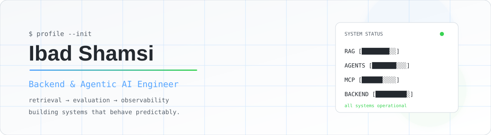

<picture>
  <source media="(prefers-color-scheme: dark)" srcset="./assets/hero-dark.svg" />
  <source media="(prefers-color-scheme: light)" srcset="./assets/hero-light.svg" />
  
</picture>

  

  
  
  

---

## What I build

I'm a **Backend & AI Systems Engineer** focused on retrieval pipelines, agent infrastructure, and the parts of AI systems that tend to get ignored after the demo: evaluation, observability, failure modes, and repeatability.

> I care less about making an agent look intelligent than making it behave predictably.

**Focus:** RAG · agent orchestration · evaluation · backend systems · retrieval quality

---

## Currently building

<table>
<tr>
<td width="50%" valign="top">

### Docify

Multimodal document intelligence and RAG.

`OCR → chunking → hybrid retrieval → RRF → citation verification`

**Stack:** FastAPI, Next.js, PostgreSQL, pgvector

</td>
<td width="50%" valign="top">

### Reminisce

Graph-based memory for long-running project conversations.

`conversation → memory nodes → relationships → graph retrieval`

**Stack:** Next.js, FastAPI, Claude API, OpenRouter

</td>
</tr>
</table>

---

## GitHub activity

  
  

  

---

## Selected work

### AI & agents

| Project | Highlights |
|---|---|
| **Docify** | Multimodal document RAG using Docling OCR, hybrid Voyage + BM25 retrieval fused with Reciprocal Rank Fusion, and citation verification back to source passages. |
| **Reminisce** | Converts long project conversations into searchable connected memory nodes with graph retrieval across non-linear dependencies. |
| **ForkedRap** | End-to-end AI content pipeline for scripting, image/video generation, rendering, and scheduling. |

### Systems & experiments

| Project | Highlights |
|---|---|
| **Beatlab** | Browser-native beat maker with a lookahead scheduler, piano roll, and WAV export using `OfflineAudioContext`. |
| **NOIR** | PS2-inspired browser FPS horror experiment using Three.js, procedural audio, Bayer dithering, and multiple endings. |
| **Antidote** | Playlist analysis and music discovery using Python, React Native, and recommendation logic. |
| **Stakked** | Artist asset creator with backend catalogues and a recommendation engine. |

<b>Data & ML work</b>

 

| Project | Highlights |
|---|---|
| **Liver Segmentation & Tumor Analysis** | U-Net family models for CT segmentation, evaluated using segmentation metrics. |
| **Cart Abandonment Analysis** | SQL/Python/Power BI analysis identifying a modeled recovery opportunity across high-intent abandoned sessions. |
| **Carbon Emission Analysis** | End-to-end data analysis from raw CSVs to Power BI dashboards covering 142 countries. |

---

## Engineering stack

**Core**

  

**AI / Data**

  

**Exploring**

  

---

## Contribution activity

  

