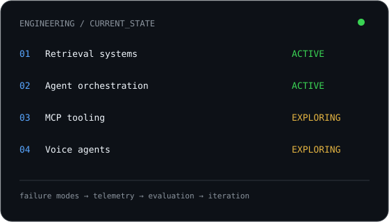

<div align="center">

<picture>
  <source media="(prefers-color-scheme: dark)" srcset="./assets/hero-dark.svg">
  <source media="(prefers-color-scheme: light)" srcset="./assets/hero-light.svg">
  
</picture>

<br>

<a href="https://forklift22.vercel.app">
  
</a>
<a href="mailto:forklift027@gmail.com">
  
</a>
<a href="https://github.com/Tunasmelt">
  
</a>

</div>

---

<table>
<tr>
<td width="58%" valign="top">

## `> whoami`

**Ibad Shamsi**

**Backend & Agentic AI Engineer**

I build systems that do work on their own — then obsess over the engineering underneath them:

- retrieval quality
- agent orchestration
- evaluation
- observability
- failure modes
- repeatability

> I care less about making an agent look intelligent than making it behave predictably.

**Currently exploring**

`RAG` · `MCP` · `Agent Systems` · `Graph Retrieval` · `Voice Agents`

</td>

<td width="42%" valign="top">



</td>
</tr>
</table>

---

## `// github telemetry`

<div align="center">

<table>
<tr>
<td width="50%" valign="top">


</td>
<td width="50%" valign="top">


</td>
</tr>
</table>


</div>

---

## `// featured systems`

<table>
<tr>
<td width="50%" valign="top">

### `01 / DOCIFY`

**Multi-tenant SaaS for document Q&A**

Three-tier OCR fallback, provider-partitioned RRF hybrid retrieval, SSE streaming responses.

**Stack**

`Next.js 14` `FastAPI` `Supabase` `Voyage AI` `Gemini`

</td>

<td width="50%" valign="top">

### `02 / REMINISCE`

**AI context orchestration & idea synthesis**

Injects project context into a project-management integration; context can be shared across a team.

**Stack**

`Next.js 14` `SaaS`

</td>
</tr>

<tr>
<td width="50%" valign="top">

### `03 / DRIFTER`

**Proxy-based regression harness for MCP tool schemas**

Catches breaking changes in MCP tool schemas before they ship. Published on PyPI.

**Stack**

`Python` `PyPI` `MCP`

</td>

<td width="50%" valign="top">

### `04 / STRUC.TXT`

**Structured notes from rough capture**

Turns spoken or pasted notes into structured records via LLM, pinned to a draggable corkboard. Custom templates, auto-tagging, action-item extraction, version history alongside the raw capture.

**Stack**

`LLM` `Corkboard UI`

</td>
</tr>
</table>

---

## `// other builds`

| Project | What it is |
|---|---|
| **BeatLab** | Browser-native beat maker on the Web Audio API. Sub-5ms scheduler drift, piano roll, swing and per-step velocity, WAV export via `OfflineAudioContext`, share-by-URL encoding. |
| **NOIR: Transit** | First-person psychological horror game in the browser, PS2-era aesthetic. Procedural audio one-shots, zone-based ambient scheduling, headless pixel-measurement rig for render verification. |
| **Manifest** | Note/story/novel sharing platform. Next.js 15 + Expo monorepo on Supabase, pure-TypeScript layout engine (86 tests), asset upload pipeline. |
| **Cerebro 2.0** | Multimodal RAG app with a brain-graph visualization UI. FastAPI + Next.js 15 + Supabase, `halfvec(1024)` embeddings, sealed-file tier with client-side WebCrypto key derivation. |
| **ForkedRap** | AI social media automation pipeline for hip-hop content. Fetch pipeline with a human review gate, schema-first mapping compiler emitting deterministic versioned artifacts with zero LLM calls on the happy path. Exposed as an MCP server. |
| **Agent-OS** | Framework for structuring and controlling AI coding agents. Stack-agnostic config, tiered memory, gated phase pipeline (spec → design → plan → TDD → review → PR). |

---

## `// engineering stack`

<div align="center">


<br><br>


</div>

---

## `// data & ML archive`

<details>
<summary><b>Open previous systems & experiments</b></summary>

<br>

| Project | What it demonstrates |
|---|---|
| **Liver Segmentation & Tumor Analysis** | U-Net family models for CT segmentation with segmentation-based evaluation. |
| **Cart Abandonment Analysis** | SQL + Python + Power BI analysis of 5,000 sessions and modeled recovery opportunities. |
| **Carbon Emission Analysis** | Raw CSV → analysis → Power BI dashboard across 142 countries. |

</details>

---

## `// contribution stream`

<div align="center">

<picture>
  <source media="(prefers-color-scheme: dark)" srcset="https://raw.githubusercontent.com/Tunasmelt/Tunasmelt/output/github-contribution-grid-snake-dark.svg">
  <source media="(prefers-color-scheme: light)" srcset="https://raw.githubusercontent.com/Tunasmelt/Tunasmelt/output/github-contribution-grid-snake.svg">
  
</picture>

</div>

---

<table>
<tr>
<td width="50%" valign="top">

### `// now`

- Building deeper MCP tooling
- Exploring agent evaluation patterns
- Working with graph-based retrieval
- Expanding backend architecture skills
- Experimenting with voice-agent systems

</td>

<td width="50%" valign="top">

### `// principles`

```text
build
  ↓
measure
  ↓
break
  ↓
observe
  ↓
fix
  ↓
repeat
```

**Reliable systems > impressive demos**

</td>
</tr>
</table>

---
